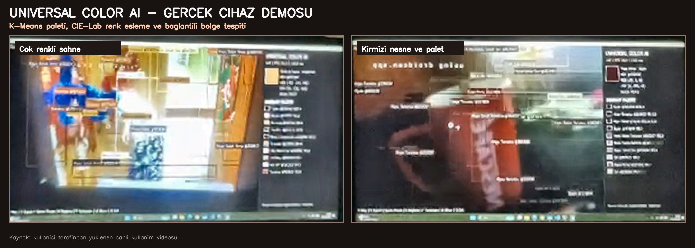
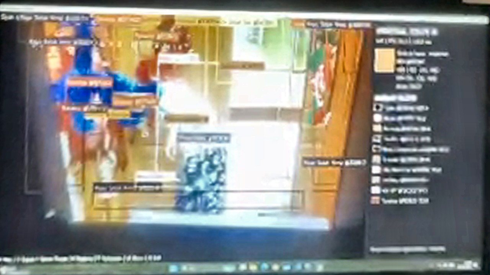
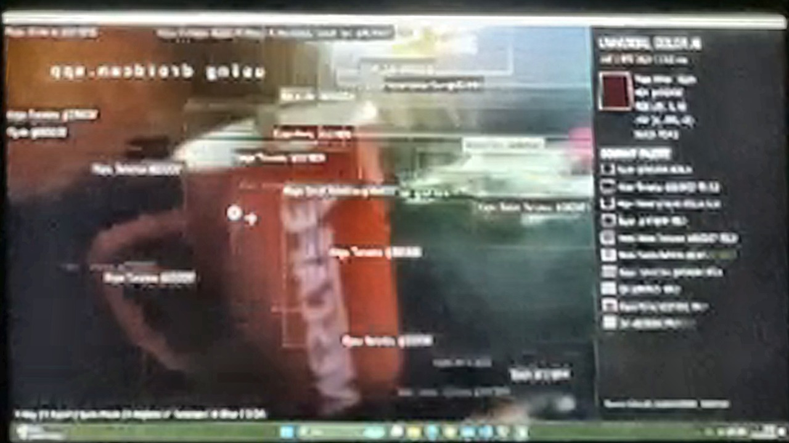
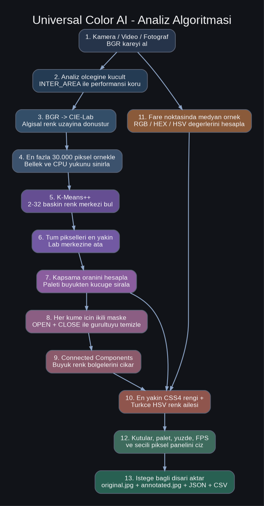

<div align="center">



# 🎨 Universal Color AI

### Kamera, video ve fotoğraflardaki renkleri gerçek zamanlı analiz eden çevrimdışı bilgisayarlı görü sistemi


**Her pikselin gerçek RGB, HEX, BGR ve HSV değerini ölçer; baskın renkleri K-Means ile çıkarır, renk bölgelerini işaretler ve CIE-Lab uzaklığıyla en yakın standart renk adını bulur.**

</div>

---

## 🎬 Gerçek kullanım demosu

<div align="center">
  
  <p><em>Bu GIF, uygulamanın gerçek bilgisayarda çalıştırıldığı kullanıcı videosundan hazırlanmıştır.</em></p>
</div>

| Çok renkli sahne analizi | Kırmızı nesne ve baskın palet |
|---|---|
|  |  |

> [!NOTE]
> Görseller telefonla monitör üzerinden kaydedilmiş gerçek kullanım videosundan çıkarıldığı için ekran yansıması ve kamera pozlaması görülebilir. Uygulamanın kendi `S` dışa aktarma çıktıları daha nettir.

---

## 📑 İçindekiler

- [Proje hakkında](#-proje-hakkında)
- [Özellikler](#-özellikler)
- [Algoritma özeti](#-algoritma-özeti)
- [Matematiksel temel](#-matematiksel-temel)
- [Sözde kod](#-sözde-kod)
- [Hızlı başlangıç](#-hızlı-başlangıç)
- [Kontroller](#-kontroller)
- [Komut satırı](#-komut-satırı)
- [Yapılandırma](#-yapılandırma)
- [Çıktılar](#-çıktılar)
- [Proje yapısı](#-proje-yapısı)
- [Performans](#-performans)
- [Kamera sorunları](#-kamera-sorunları)
- [Sınırlamalar](#-sınırlamalar)
- [Gizlilik](#-gizlilik)
- [Lisans](#-lisans)

---

## 🌈 Proje hakkında

**Universal Color AI**, ağır bir model indirmeden çalışan yerel bir renk analizi uygulamasıdır. Kamera, video veya fotoğraf karesini işler ve iki seviyede bilgi üretir:

1. **Noktasal ölçüm:** Fare imlecinin altındaki gerçek piksel rengi.
2. **Sahne analizi:** Görüntünün baskın renkleri ve bağlantılı renk bölgeleri.

RGB uzayında `256 × 256 × 256 = 16.777.216` olası sayısal renk değeri vardır. Bu değerlerin tamamının günlük dilde ayrı adı bulunmadığı için sistem:

- sayısal değeri **RGB / BGR / HSV / HEX** olarak korur,
- tonu Türkçe bir renk ailesine ayırır,
- CIE-Lab uzayında en yakın **CSS4** renk adını bulur.

Örnek:

```text
Açık Canlı Mavi · dodgerblue
HEX  #1E90FF
RGB  (30, 144, 255)
HSV  (105, 225, 255)
Match %92.4
```

---

## ✨ Özellikler

| Özellik | Açıklama |
|---|---|
| 🎥 Canlı kamera | Dahili veya USB kamerayı gerçek zamanlı işler. |
| 🎬 Video desteği | Yerel video dosyasını etkileşimli analiz eder. |
| 🖼️ Fotoğraf analizi | Kameraya ihtiyaç duymadan görsel dosyasını işler. |
| 🌈 Evrensel piksel ölçümü | Sabit birkaç HSV aralığına bağlı kalmadan her pikseli ölçer. |
| 🧠 CIE-Lab eşleştirme | Renk adını algısal renk uzaklığıyla belirler. |
| 🧩 K-Means++ | Sahnedeki baskın renk merkezlerini otomatik keşfeder. |
| 🗺️ Renk bölgesi çıkarımı | Connected Components ile büyük ve bağlantılı renk alanlarını bulur. |
| 🧹 Morfolojik filtreleme | OPEN ve CLOSE işlemleriyle küçük gürültüleri azaltır. |
| 🖱️ Canlı piksel seçici | Fare altındaki rengi anlık gösterir. |
| 🔒 Piksel kilitleme | Sol tıkla seçimi kilitler, sağ tıkla serbest bırakır. |
| 📊 Baskın renk paleti | Renkleri yaklaşık kapsama yüzdeleriyle listeler. |
| ⚡ Adaptif zamanlayıcı | Analiz yavaşsa kare aralığını otomatik artırır. |
| 📷 Kamera tarama | Windows üzerinde DSHOW, MSMF ve ANY arka uçlarını dener. |
| 💾 Çoklu dışa aktarma | Orijinal, işaretli görsel, JSON ve CSV üretir. |
| 🔐 Yerel çalışma | Görüntüyü harici API veya buluta göndermez. |

---

## 🧠 Algoritma özeti



### İşlem hattı

1. Kamera, video veya fotoğraftan BGR kare alınır.
2. Kare `analysis_width` değerine küçültülür.
3. BGR verisi insan algısına daha yakın **CIE-Lab** uzayına çevrilir.
4. En fazla `30.000` Lab pikseli örneklenir.
5. **K-Means++** ile `2–32` renk merkezi bulunur.
6. Görüntüdeki tüm pikseller en yakın merkeze atanır.
7. Her kümenin kapsama oranı hesaplanır ve palet sıralanır.
8. Her küme için ikili maske oluşturulur.
9. Eliptik `5×5` çekirdekle OPEN ve CLOSE uygulanır.
10. Connected Components ile büyük bağlantılı bölgeler çıkarılır.
11. Renk Türkçe HSV ailesi ve en yakın CSS4 adıyla etiketlenir.
12. Kutular, palet, FPS, işlem süresi ve seçili piksel paneli çizilir.
13. İstenirse JPG, JSON ve CSV dosyaları kaydedilir.

---

## 📐 Matematiksel temel

### K-Means amacı

Lab pikselleri `xᵢ`, renk merkezleri `μⱼ` olsun:

```text
J = Σᵢ ||xᵢ - μc(i)||²
```

`c(i)`, `xᵢ` pikselinin atandığı en yakın kümedir.

Kod ayarları:

- Başlangıç: `KMEANS_PP_CENTERS`
- Maksimum iterasyon: `35`
- Yakınsama toleransı: `0.7`
- Deneme sayısı: `4`
- Rastgele tohum: `42`

### Kapsama oranı

```text
coverage(k) = cluster_pixel_count(k) / total_pixel_count
```

`coverage < min_coverage` olan küçük kümeler paletten çıkarılır.

### En yakın renk adı

Ölçülen rengin Lab değeri `p`, CSS4 referans renginin Lab değeri `rⱼ`:

```text
nearest_name = argminⱼ ||p - rⱼ||₂
```

### Benzerlik yüzdesi

```text
confidence = clamp(100 × exp(-distance_lab / 34), 0, 100)
```

Bu değer bir yapay zekâ olasılığı değil, Lab uzaklığından üretilen benzerlik göstergesidir.

### Medyan piksel örnekleme

`sample_radius > 0` olduğunda tek piksel yerine küçük komşuluk kullanılır:

```text
sample_bgr = median(patch_pixels)
```

Bu yöntem sensör kaynaklı tek piksellik parazitleri azaltır.

---

## 🧾 Sözde kod

```text
function ANALYZE(frame, settings):
    assert frame is not empty

    small = resize_to_width(frame, settings.analysis_width)
    lab = convert_BGR_to_Lab(small)

    samples = random_sample(lab.pixels, maximum=30000)
    centers = KMEANS_PLUS_PLUS(
        samples,
        k=clamp(settings.clusters, 2, 32),
        max_iterations=35,
        epsilon=0.7,
        attempts=4
    )

    labels = assign_all_pixels_to_nearest_center(lab, centers)

    for cluster in clusters_sorted_by_pixel_count(labels):
        coverage = pixel_count(cluster) / total_pixel_count

        if coverage < settings.min_coverage:
            continue

        color = convert_Lab_center_to_BGR(cluster.center)
        name = resolve_turkish_family_and_nearest_CSS4(color)
        palette.append(color, name, coverage)

        if settings.show_regions:
            mask = labels == cluster.id
            mask = MORPH_OPEN(mask, ellipse_5x5)
            mask = MORPH_CLOSE(mask, ellipse_5x5)

            for component in CONNECTED_COMPONENTS(mask):
                if component.area >= scaled_min_area:
                    regions.append(component.bounding_box, color, name)

    selected = median_color_around_mouse(frame)
    return palette, largest_regions, selected
```

---

## 🚀 Hızlı başlangıç

### Otomatik yöntem

1. ZIP’i normal bir klasöre çıkart.
2. `BASLAT.bat` dosyasına çift tıkla.
3. İlk açılışta sanal ortam ve bağımlılıklar hazırlanır.

### Ayrı kurulum

```text
KURULUM.bat
```

Ardından:

```text
BASLAT.bat
```

### Manuel kurulum

```powershell
py -m venv .venv
.\.venv\Scripts\Activate.ps1
python -m pip install -r requirements.txt
python launcher.py run
```

---

## 🎮 Kontroller

| Tuş / hareket | İşlem |
|---|---|
| `Q` veya `ESC` | Uygulamayı kapatır. |
| `H` | Yardım panelini açar/kapatır. |
| `R` | Renk bölgesi kutularını açar/kapatır. |
| `M` | Görüntüyü aynalar/normal hâle getirir. |
| `F` | Tam ekranı açar/kapatır. |
| `SPACE` | Analizi duraklatır/devam ettirir. |
| `S` | Mevcut kareyi ve analiz verilerini dışa aktarır. |
| Fare hareketi | İmleç altındaki rengi canlı ölçer. |
| Sol tık | Seçilen pikseli kilitler. |
| Sağ tık | Kilidi kaldırır. |

---

## ⌨️ Komut satırı

### Kamera

```powershell
.\.venv\Scripts\python.exe launcher.py run
```

### Belirli kamera

```powershell
.\.venv\Scripts\python.exe launcher.py run --camera 1 --backend dshow
```

Arka uçlar:

```text
auto | dshow | msmf | any
```

### Video

```powershell
.\.venv\Scripts\python.exe launcher.py run --source ".\video.mp4"
```

### Fotoğraf

```powershell
.\.venv\Scripts\python.exe launcher.py analyze ".\fotograf.jpg" --output ".\output"
```

Pencerede göstermek için:

```powershell
.\.venv\Scripts\python.exe launcher.py analyze ".\fotograf.jpg" --output ".\output" --show
```

### Kamera tarama

```powershell
.\.venv\Scripts\python.exe launcher.py cameras --scan-limit 10
```

veya:

```text
KAMERA_TARA.bat
```

### Ayar dosyası oluşturma

```powershell
.\.venv\Scripts\python.exe launcher.py init-config --output ".\config.json"
```

---

## ⚙️ Yapılandırma

```json
{
  "camera": 0,
  "backend": "auto",
  "scan_limit": 10,
  "width": 1280,
  "height": 720,
  "clusters": 12,
  "analysis_width": 360,
  "analyze_every": 4,
  "min_area": 800,
  "min_coverage": 0.003,
  "max_palette": 10,
  "max_regions": 24,
  "sample_radius": 2,
  "mirror": true,
  "show_regions": true,
  "adaptive_performance": true,
  "target_fps": 24.0,
  "output_dir": "output"
}
```

| Ayar | Varsayılan | Açıklama |
|---|---:|---|
| `camera` | `0` | Tercih edilen kamera indeksi. |
| `backend` | `"auto"` | Kamera arka ucu. |
| `scan_limit` | `10` | Taranacak indeks sayısı. |
| `width` / `height` | `1280×720` | İstenen kamera çözünürlüğü. |
| `clusters` | `12` | K-Means küme sayısı; `2–32`. |
| `analysis_width` | `360` | Analiz görüntüsü genişliği. |
| `analyze_every` | `4` | Tam analizin kare aralığı. |
| `min_area` | `800` | Minimum renk bölgesi alanı. |
| `min_coverage` | `0.003` | Minimum palet kapsama oranı. |
| `max_palette` | `10` | Gösterilecek renk sayısı. |
| `max_regions` | `24` | Çizilecek bölge sayısı. |
| `sample_radius` | `2` | Medyan örnek yarıçapı. |
| `mirror` | `true` | Yatay aynalama. |
| `show_regions` | `true` | Kutuları başlangıçta gösterir. |
| `adaptive_performance` | `true` | Analiz aralığını otomatik ayarlar. |
| `target_fps` | `24.0` | Adaptif hedef FPS. |
| `output_dir` | `"output"` | Çıktı klasörü. |

### Hızlı profil

```json
{
  "clusters": 8,
  "analysis_width": 240,
  "analyze_every": 6,
  "max_regions": 12
}
```

### Ayrıntılı profil

```json
{
  "clusters": 20,
  "analysis_width": 480,
  "analyze_every": 3,
  "max_regions": 32
}
```

---

## 💾 Çıktılar

```text
output/
└── color-analysis-YYYYMMDD-HHMMSS-000123/
    ├── original.jpg
    ├── annotated.jpg
    ├── analysis.json
    └── palette.csv
```

`analysis.json` içinde kaynak boyutu, işlem süresi, palet, bölgeler, HEX/RGB/HSV ve renk açıklamaları bulunur.

---

## 📁 Proje yapısı

```text
UniversalColorAI_Clean/
├── BASLAT.bat
├── KURULUM.bat
├── KAMERA_TARA.bat
├── launcher.py
├── requirements.txt
├── config.example.json
├── README.md
├── LICENSE
├── .gitignore
├── docs/
│   └── assets/
│       ├── hero-demo.jpg
│       ├── demo-live.gif
│       ├── demo-colorful-analysis.jpg
│       ├── demo-red-object.jpg
│       └── algorithm-flow.png
└── src/
    └── universal_color_ai/
        ├── analysis.py
        ├── app.py
        ├── camera.py
        ├── cli.py
        ├── color_names.py
        ├── config.py
        ├── exporters.py
        ├── models.py
        ├── renderer.py
        └── data/
            └── css4_colors.json
```

---

## ⚡ Performans

Yaklaşık işlem maliyeti; analiz pikseli `N`, küme sayısı `K`, iterasyon `I`, kanal boyutu `D=3` için:

```text
O(N × K × I × D)
```

En etkili ayarlar:

- `analysis_width`
- `clusters`
- `analyze_every`
- `max_regions`
- kamera çözünürlüğü

Adaptif zamanlayıcı son 12 analiz süresini izler. Analiz hedef sürenin yaklaşık `1.7×` üzerine çıkarsa aralığı artırır; `0.75×` altına inerse azaltır.

---

## 📷 Kamera sorunları

### Kamera bulunamıyor

Önce:

```text
KAMERA_TARA.bat
```

Sonra bulunan indeksi kullan:

```powershell
.\.venv\Scripts\python.exe launcher.py run --camera 1
```

### Windows arka uçları

```powershell
.\.venv\Scripts\python.exe launcher.py run --camera 0 --backend dshow
```

Olmazsa:

```powershell
.\.venv\Scripts\python.exe launcher.py run --camera 0 --backend msmf
```

### İzinler

```text
Ayarlar
└── Gizlilik ve güvenlik
    └── Kamera
        ├── Kamera erişimi: Açık
        ├── Uygulamaların kamera erişimi: Açık
        └── Masaüstü uygulamalarının kamera erişimi: Açık
```

Teams, Discord, OBS, Zoom veya tarayıcı kamerayı kullanıyorsa kapat.

---

## ⚠️ Sınırlamalar

- Sistem nesnenin türünü değil, görüntüdeki **rengi** analiz eder.
- “Kırmızı araba” yerine “kırmızı bölge” sonucu verir.
- Işık, yansıma, beyaz dengesi ve pozlama sonucu etkiler.
- Renk isimleri sürekli renk uzayının standart isimlere yaklaşık eşlemesidir.
- Yakın tonlar `clusters` düşükse aynı kümeye girebilir.
- Küçük bölgeler `min_area` nedeniyle gösterilmeyebilir.
- Benzerlik yüzdesi model olasılığı değildir.

Nesne türü için sistem ileride YOLO gibi bir nesne algılama modeliyle birleştirilebilir.

---

## 🔐 Gizlilik

- Görüntüler RAM üzerinde yerel işlenir.
- Bulut veya harici API kullanılmaz.
- `S` tuşuna basılmadıkça analiz paketi kaydedilmez.
- Çıktılar yalnızca yerel `output` klasöründedir.

---

## 🧰 Teknolojiler

- 🐍 Python
- 👁️ OpenCV
- 🔢 NumPy
- 🎨 CIE-Lab
- 🧩 K-Means++
- 🗺️ Connected Components
- 🧹 Morphological Opening / Closing
- 📄 JSON / CSV

---

## 📄 Lisans

Proje **MIT License** altında sunulur. Ayrıntılar için [`LICENSE`](LICENSE) dosyasına bakın.

---

<div align="center">

### 👨‍💻 Geliştirici

**Mert Demir**  
GitHub: **[@itsmertdemirr](https://github.com/itsmertdemirr)**

⭐ Projeyi faydalı bulduysan GitHub üzerinde yıldız verebilirsin.

</div>
